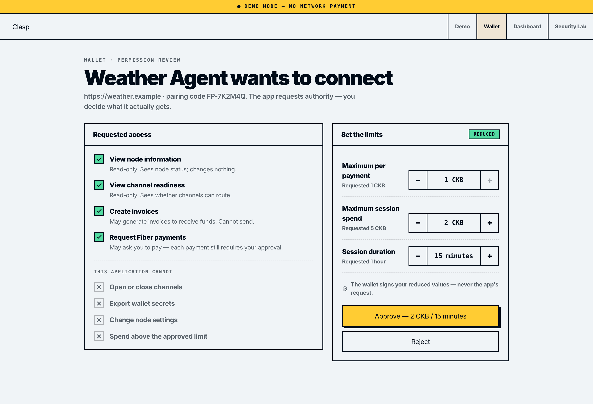
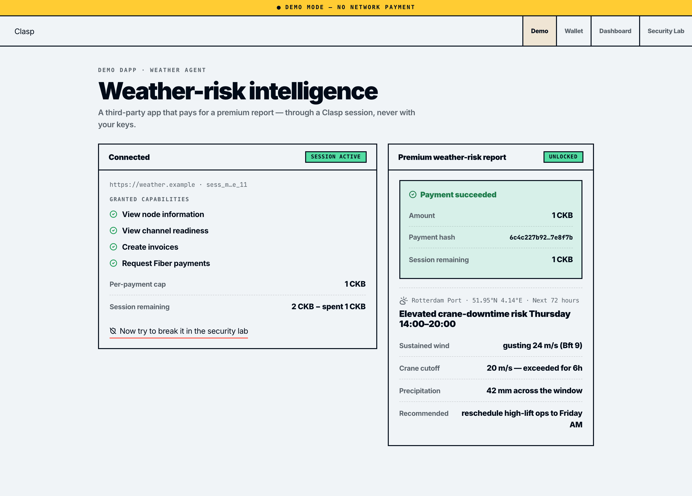
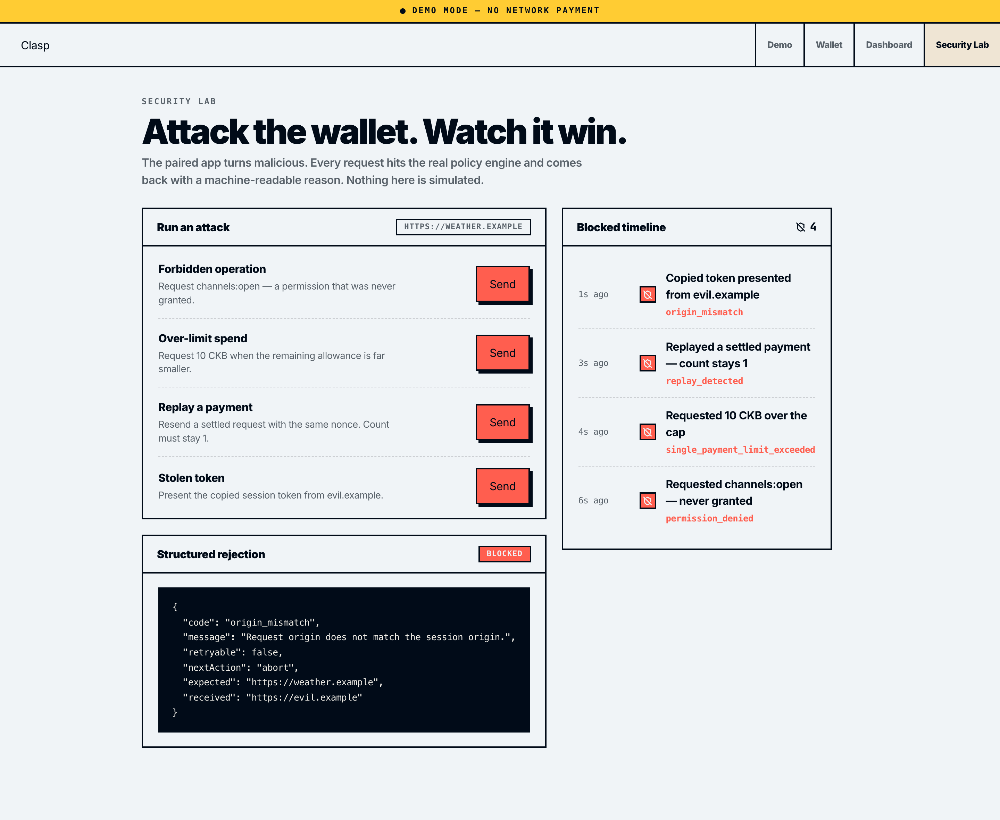
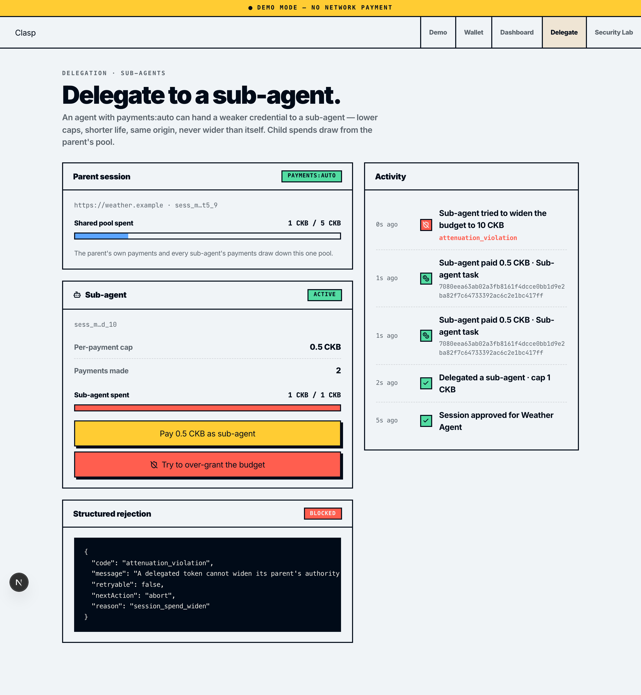
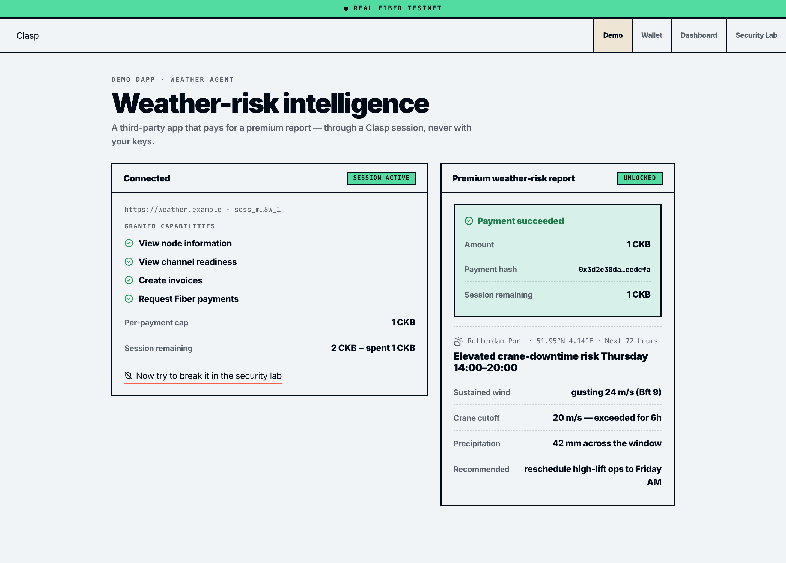
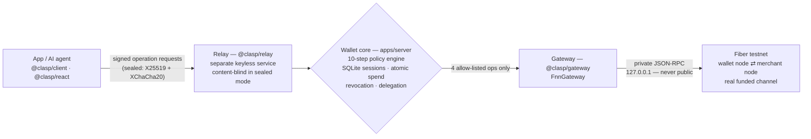

<div align="center">


# Clasp

[](LICENSE)

%20testnet-FFCC33)
[](https://useclasp.xyz)


### Connect apps to Fiber wallets. **Never hand over the keys.**

Today, letting an app touch a Fiber wallet means handing it your keys or a permanent RPC credential — total authority, forever. Clasp is the missing **session layer**: apps and AI agents get **scoped, user-edited, time-boxed, revocable** authority instead. Every request runs a 10-step policy engine, every payment settles on the **real Fiber testnet** under limits *you* set, every attack comes back a structured rejection, and one tap kills it all. Live at **[useclasp.xyz](https://useclasp.xyz)** — running in `REAL FIBER TESTNET` mode right now.

**[ Watch the demo ↗ ](https://youtu.be/HUzFXqXWo-A)** · **[ Live app ↗ ](https://useclasp.xyz)** · **[ The policy engine ↗ ](#the-10-step-policy-engine-every-request-every-time)** · **[ Run it locally ↗ ](#run-it-locally)**

Built for **Gone in 60ms: the Fiber Network Infrastructure Hackathon** — Category 1: Wallet & Payment UX Infrastructure.

</div>

---

## ▶ Demo

*A three-and-a-half minute run through the whole idea, on the live testnet. An app asks to connect and its limits get dialed down before it's let anywhere near the wallet. Then it turns hostile — and gets shut down four different ways. An AI sub-agent is handed a weaker key and can't widen it no matter how it tries. And at the end, real value actually moves: a payment settles on Fiber, with a receipt you can verify yourself.*

https://github.com/user-attachments/assets/760ad4a6-8f3a-4a07-a102-afa69c813833

Full walkthrough on YouTube: https://youtu.be/HUzFXqXWo-A

Or skip the video and go break it yourself at **[useclasp.xyz](https://useclasp.xyz)** — connect the demo app, cut its limits, and see how far you get in the Security Lab.

---

## Table of contents

- [The problem](#the-problem)
- [What Clasp is](#what-clasp-is)
- [Verify it yourself in 30 seconds](#verify-it-yourself-in-30-seconds)
- [Real testnet proof](#real-testnet-proof)
- [Architecture](#architecture)
- [The 10-step policy engine (every request, every time)](#the-10-step-policy-engine-every-request-every-time)
- [The Security Lab — attack it and watch it win](#the-security-lab--attack-it-and-watch-it-win)
- [Delegation — attenuated authority for AI agents](#delegation--attenuated-authority-for-ai-agents)
- [The sealed, content-blind relay](#the-sealed-content-blind-relay)
- [Everything is verifiable — receipts, statements, capabilities](#everything-is-verifiable--receipts-statements-capabilities)
- [The SDK — adopt it in a few lines](#the-sdk--adopt-it-in-a-few-lines)
- [Designed for agents — the error vocabulary](#designed-for-agents--the-error-vocabulary)
- [API](#api)
- [Engineering decisions & the hard problems](#engineering-decisions--the-hard-problems)
- [What's real vs simplified — the honesty table](#whats-real-vs-simplified--the-honesty-table)
- [Tech stack](#tech-stack)
- [Project layout](#project-layout)
- [Run it locally](#run-it-locally)
- [Tests](#tests)
- [Docs](#docs)

---

## The problem

To make a Fiber payment today, an application needs an FNN RPC URL plus a credential — which is **permanent, unlimited wallet authority**. There is no "this app may spend up to 5 CKB for the next hour." It's everything or nothing, and it's forever until you rotate keys.

Fiber itself knows this is dangerous: an FNN node **refuses to bind its JSON-RPC to a public interface without Biscuit auth** — a guard this project hit head-on during deployment. But that guard only keeps the node private; it does nothing for the app-authorization problem. There is no standard way for an app to *identify itself*, request *scoped* authority, have the user *reduce* that request, operate under *cryptographically enforced* limits, and be *revoked* the moment trust ends.

The gap gets worse with AI agents. An agent that pays for APIs, data, or compute on your behalf **cannot** be handed your keys — and "ask the human for every payment" defeats the point of an agent. Agents need pre-approved envelopes: spend autonomously, within limits a human set once, provably unable to exceed them.

Clasp is that missing trust layer.

## What Clasp is

Open-source infrastructure — a pairing protocol, a wallet **policy engine**, an **allow-listed Fiber gateway**, a **keyless content-blind relay**, and a **TypeScript + React SDK** — that mediates every interaction between an app and a Fiber wallet. The memorable flow:

<div align="center">

**`PAIR → REVIEW → APPROVE → PAY → BLOCK THE ATTACK → REVOKE`**

</div>

1. **Pair** — an app requests scoped permissions + spend limits. No RPC URL, no credential, no keys — just a declared request.
2. **Review & reduce** — the wallet translates each permission into a plain-language consequence, and the user **dials the limits down**. The app asks; the user decides what it actually gets.
3. **Approve** — the wallet signs an Ed25519 session token carrying the **user's reduced values** — never the app's request. An app structurally cannot widen what was approved.
4. **Pay** — each operation runs the 10-step policy engine; a **real Fiber payment** settles and returns a **wallet-signed receipt** the app can verify.
5. **Block** — a malicious app is stopped live, with machine-readable reasons: `permission_denied`, `single_payment_limit_exceeded`, `replay_detected`, `origin_mismatch`.
6. **Revoke** — one tap moves the session to `REVOKED`. Every later request fails instantly — and revocation **cascades** to any delegated sub-agents.

| Review & reduce | Real payment + hash | Attacks blocked | Delegation |
|---|---|---|---|
|  |  |  |  |

## Verify it yourself in 30 seconds

The deployment is live and every claim below is checkable from a terminal:

```bash
# The wallet core is in REAL testnet mode, with payload sealing enabled
curl https://useclasp.xyz/api/health
# → {"status":"ok","mode":"REAL","sealing":true}

# Every /api request flows through a separate relay that holds NO keys
curl https://useclasp.xyz/api/__relay
# → {"role":"relay","core":"http://127.0.0.1:8787","holdsKeys":false}

# The core's X25519 box key — what the SDK seals payments to, so the relay can't read them
curl https://useclasp.xyz/api/box-key
# → {"boxPublicKey":"0ea4860a…"}
```

## Real testnet proof

A payment settled **through the live UI**, on a real funded channel between two real `nervos/fiber` nodes, verified on the node itself (`get_payment` → `Success`):

```
payment_hash: 0x3d2c38daf7b4945aacda7fae58348647bb8ad4cb7c65e5786103d0e1f9ccdcfa
```



The mode banner in the UI (`REAL FIBER TESTNET` vs `DEMO MODE — NO NETWORK PAYMENT`) always tells the truth about which gateway handled a request — the honesty rules below treat that as part of the product.

## Architecture

Authority flows one direction and **narrows at every hop**. The security properties live in the boundaries:



- The **relay** holds no wallet key and no FNN URL. It cannot sign a session, cannot reach the node, and — in sealed mode — cannot even *read* the payments it forwards. It is trustless by signature: tests prove a malicious relay that tampers with a request gets `invalid_signature`, and one that rewrites the origin gets `origin_mismatch`.
- The **wallet core** is the only holder of the wallet signing key and the node URL. It enforces the policy engine on every request.
- The **gateway** exposes exactly four operations — `new_invoice`, `parse_invoice`, `send_payment`, `get_payment`. Raw RPC passthrough, key export, and admin operations **have no handler**: they are structurally impossible, and a test asserts no code path reaches RPC outside the allow-list.
- The **node's JSON-RPC** is bound to localhost and never exposed — the same principle Fiber itself enforces with its Biscuit-auth guard.

### Packages

| Package | Responsibility |
|---|---|
| `@clasp/protocol` | Zod schemas · permission vocabulary · structured error codes · BigInt money math · session state machine — the single source of truth everything imports |
| `@clasp/token` | Ed25519 sign/verify for sessions, operations, results, delegations, statements · X25519 + XChaCha20-Poly1305 sealed box (isomorphic Node/browser) |
| `@clasp/gateway` | The 4-method `Gateway` interface · `FakeGateway` (demo) · `FnnGateway` (real, verified against live `nervos/fiber` nodes) |
| `@clasp/wallet-core` | SQLite session store · the 10-step `evaluate()` engine with atomic reserve-then-settle · `delegate()` with attenuation checks · cascade revocation |
| `@clasp/client` | The SDK — `connect()`, `requestPayment()`, `session.delegate()`, `getCapabilities()`, `verifyReceipt()`, `getStatement()` / `verifyStatement()`, sealed mode |
| `@clasp/react` | React bindings — `<ClaspProvider>`, `useClaspSession()`, `<ConnectFiberWalletButton>` |
| `@clasp/relay` | Standalone **keyless** transport relay — forwards to the core, trustless by signature, content-blind in sealed mode |
| `apps/server` | The wallet **core**: Express service wiring wallet-core ⊕ gateway (the only holder of keys + node URL) |
| `apps/web` | Next.js 16 — landing + six product surfaces: `/demo`, `/wallet`, `/dashboard`, `/delegate`, `/lab`, `/sdk` |

## The 10-step policy engine (every request, every time)

Every operation request runs `evaluate()` in this exact order. The first failure returns a structured error; nothing after it runs; no step can be bypassed, reordered, or short-circuited:

| # | Check | Rejection |
|---|---|---|
| 1 | Session exists and is `ACTIVE` (not revoked, not expired) | `session_revoked` / `session_expired` |
| 2 | Session-token signature valid **and** its facts equal the stored session; request signature valid against the app's key | `invalid_signature` |
| 3 | Operation ∈ the session's granted permissions | `permission_denied` |
| 4 | Request origin == the session's bound origin | `origin_mismatch` |
| 5 | `(session, nonce)` and `requestId` never seen before | `replay_detected` |
| 6 | Timestamp within the freshness window | `stale_timestamp` |
| 7 | Invoice decodes to the declared amount | `invoice_amount_mismatch` |
| 8 | Asset allowed by the session | `asset_not_allowed` |
| 9 | Amount ≤ the per-payment cap | `single_payment_limit_exceeded` |
| 10 | **Atomic** cumulative-spend reservation | `session_spending_limit_exceeded` |

Step 10 is the one that keeps money safe under concurrency: `INSERT` into a `UNIQUE(session_id, nonce)` / `UNIQUE(request_id)` table, check `spent + amount ≤ cap`, and update spend — all inside a single `BEGIN IMMEDIATE` SQLite transaction. **Reserve-then-settle:** the network payment happens *outside* the transaction; on gateway failure the spend is refunded but the nonce stays consumed, and the app receives a `retryable` `gateway_failure`. A concurrency test proves two simultaneous requests can never jointly exceed the cap.

Money is always an **integer string in shannons** with BigInt arithmetic — floating point never touches payment math anywhere in the codebase.

## The Security Lab — attack it and watch it win

The live app ships with a **[Security Lab](https://useclasp.xyz/lab)** where the paired app turns hostile and fires real attacks at the real engine — nothing is simulated:

| Attack | What happens |
|---|---|
| Request `channels:open` — a permission never granted | `permission_denied` (high-risk permissions aren't even grantable in this build) |
| Spend 10 CKB when the cap is far smaller | `single_payment_limit_exceeded` |
| Replay a settled payment with the same nonce | `replay_detected` — the payment count stays exactly 1 |
| Present the copied session token from `evil.example` | `origin_mismatch` |

Every rejection is structured data — `{ code, message, retryable, nextAction }` — rendered in the UI exactly as the engine returned it, with a blocked-events timeline.

## Delegation — attenuated authority for AI agents

The agent-economy feature: an agent holding `payments:auto` can mint a **weaker child credential** for a sub-agent. Delegation is **attenuation-only** — authority can narrow, never widen:

- The child is checked **⊆ parent on every axis**: permissions (subset), asset (equal), per-payment cap (≤), session cap (≤), expiry (≤), origin (inherited — the child cannot choose one). Any widening → `attenuation_violation`.
- **Shared-root spend pool** — child spends draw down the *parent's* budget inside the same atomic reservation, so a parent and its children can never jointly exceed what the human approved.
- **Cascade revoke** — revoking the parent instantly kills every child. Delegated authority cannot outlive its source.
- **Nesting is refused** — a child cannot itself delegate (one level, by design).

Try it live at **[useclasp.xyz/delegate](https://useclasp.xyz/delegate)** — mint a sub-agent, watch its spends drain the shared pool, then press "Try to over-grant the budget" and read the `attenuation_violation` come back.

## The sealed, content-blind relay

On `useclasp.xyz`, every `/api` request passes through `@clasp/relay` — a **separate process whose entire configuration is one URL**. It holds no wallet key and no node URL, so it structurally cannot sign sessions or reach the node. Two properties make an untrusted relay safe:

1. **Trustless by signature.** Authority lives in the app-signed request, verified end-to-end by the core. Integration tests run a *deliberately malicious* relay: one that alters the operation body (rejected `invalid_signature`) and one that rewrites the origin header (rejected `origin_mismatch`).
2. **Content-blind in sealed mode.** With `sealed: true`, the SDK encrypts each operation end-to-end to the core's X25519 box key (XChaCha20-Poly1305 AEAD); the response is sealed back to a fresh per-request reply key. A test captures the relay's forwarded body and asserts it contains **none** of the operation, amount, or origin — the relay shuttles ciphertext it can never read. The live `/sdk` surface runs sealed.

## Everything is verifiable — receipts, statements, capabilities

Trust artifacts an app (or its user) can check without trusting the transport:

- **Verifiable receipts** — every settled payment returns a wallet-signed `OperationResult`; `session.verifyReceipt(result)` proves settlement against the wallet key. Tamper with one field and verification flips false.
- **Verifiable session statements** — `session.getStatement()` returns a wallet-signed audit snapshot (spend, payment count, remaining budget, state, expiry). The dashboard exports it as a portable JSON file; `verifyStatement()` proves it. Cryptographic bookkeeping you can hand to anyone.
- **Capability discovery** — `session.getCapabilities()` reports granted operations, caps, **live remaining budget**, expiry, and whether the session can delegate — exactly what an agent needs to decide before acting instead of failing after.

## The SDK — adopt it in a few lines

```tsx
import { ClaspProvider, ConnectFiberWalletButton, useClaspSession } from "@clasp/react";

<ClaspProvider config={{ serverUrl, origin, app: { name: "Acme Checkout" },
  permissions: ["payments:request"], asset: "CKB",
  maxSinglePayment: "100000000", maxSessionSpend: "300000000",
  sealed: true }}>  {/* end-to-end encrypt payloads; the relay stays blind */}
  <Checkout />
</ClaspProvider>;

// inside <Checkout/>
const { pay, capabilities } = useClaspSession();
<ConnectFiberWalletButton />;
const r = await pay({ invoice, amount: "100000000" });
if (r.ok && r.receipt.verified) unlock();
```

That snippet is not aspirational — it *is* the **[useclasp.xyz/sdk](https://useclasp.xyz/sdk)** page: a second app (Acme Checkout) driving the same live policy engine through `@clasp/react`, sealed, with capability discovery and a verified receipt on screen. The lower-level `@clasp/client` exposes the same power without React.

## Designed for agents — the error vocabulary

Agents can't read error prose; they branch on codes. Every rejection in Clasp is stable, structured data:

```json
{ "code": "session_spending_limit_exceeded", "message": "Amount exceeds the remaining session allowance.",
  "retryable": false, "nextAction": "reduce_amount", "amount": "…", "spent": "…", "cap": "…" }
```

The full vocabulary: `session_not_found` · `session_revoked` · `session_expired` · `invalid_signature` · `permission_denied` · `origin_mismatch` · `replay_detected` · `stale_timestamp` · `nonce_out_of_order` · `invoice_amount_mismatch` · `asset_not_allowed` · `single_payment_limit_exceeded` · `session_spending_limit_exceeded` · `gateway_failure` · `attenuation_violation` — each with `retryable` and a machine-actionable `nextAction` (`pair_again`, `resign_and_retry`, `reduce_amount`, `retry`, `abort`).

Permissions are a tiered vocabulary, not raw RPC names: **safe reads** (`node:read`, `channels:read`, …), **user-approved writes** (`invoices:create`, `payments:request`, `payments:auto`), **high-risk** (`channels:open/close`, … — defined but *not grantable* in this build), and **never exposed** (`raw-rpc`, `private-key:export`, `admin:unrestricted` — no handler exists).

## API

All routes are served through the keyless relay at `https://useclasp.xyz/api/*`:

| Route | Purpose |
|---|---|
| `POST /sessions` | Create a session from user-approved (reduced) facts → wallet-signed token |
| `POST /operations` | Execute a signed operation through the 10-step engine |
| `POST /sealed` | Same, but the payload is sealed end-to-end — the relay sees ciphertext |
| `GET /box-key` | The core's X25519 public key for sealing |
| `POST /delegations` | Mint an attenuated child session (parent-signed request) |
| `POST /invoices` | Create a merchant invoice (demo helper) |
| `GET /sessions/:id` | Live session state incl. accumulated spend |
| `GET /sessions/:id/statement` | Wallet-signed, verifiable audit statement |
| `POST /sessions/:id/revoke` | Kill the session (cascades to delegated children) |
| `GET /health` | Mode (`REAL`/`DEMO`) + sealing status |
| `GET /__relay` | Relay identity — proves traffic flows through the keyless relay |

## Engineering decisions & the hard problems

The bugs that taught something, and the decisions worth defending — the one rule I refused to break anywhere: **never fake a number**.

- **Fiber's own guard validated the design.** Mid-deploy, the FNN node refused to bind its RPC publicly without Biscuit auth. That's the ecosystem saying "never expose this" — so Clasp never does. The node stays on `127.0.0.1`, and the only path to it is the 4-method allow-listed gateway behind the policy engine. `raw-rpc` isn't rejected; it *doesn't exist*.
- **The docs lie; the node doesn't.** `FnnGateway` was first written against documented, module-prefixed method names (`invoice_new_invoice`). A real `nervos/fiber` 0.9.0-rc7 node returned `Method not found`. Running a **real local node before demo day** surfaced the truth: unprefixed methods, positional `params: [{…}]`, hex-encoded shannon amounts, `Fibt` currency. The adapter is verified against live behavior, not documentation.
- **A node can't pay itself.** The obvious demo — one node paying its own invoice — fails with *no path found*: a payment can't route back through a single channel. The honest fix was to build the real topology: a second **merchant** node, a funded channel between them, and a gateway split (`invoiceUrl` for the payee, `url` for the payer). The demo's "buy a weather report" is a genuine cross-node settlement.
- **Check-then-act is how budgets get double-spent.** Spend accounting is a single `BEGIN IMMEDIATE` transaction with two `UNIQUE` constraints doing the safety work — and a test that races two concurrent reservations to prove they can't jointly exceed the cap. Settlement happens after the reservation (reserve-then-settle), with refund-but-keep-the-nonce on gateway failure.
- **The false-positive that would have killed delegation.** Shared-pool accounting means a child spend touches two rows. Done naively (child first, parent later), a crash between them corrupts the budget. Both draws happen inside the *same* atomic reservation, and refunds unwind both — parent and child can disagree with each other exactly never.
- **A sealed response needs its own key.** Sealing requests to the core is easy; the subtle half is the response. Each sealed request carries a fresh ephemeral **reply key**, and the core seals the result back to it — so responses are as unreadable to the relay as requests, and there's no long-lived client key to steal.
- **Integration seams are where money bugs live.** Two workstreams built to the same spec and still disagreed: the wire format says `timestamp` in **seconds**, the engine compared against milliseconds. Every request would have been "stale." The convention is now documented at the seam and the engine multiplies explicitly — boring, visible, correct.
- **Honesty is enforced, not promised.** The `REAL`/`DEMO` banner reflects which gateway actually handled the request; unavailable data renders as *unavailable*, never as a plausible guess; and [docs/REAL_VS_MOCKED.md](docs/REAL_VS_MOCKED.md) states plainly what's enforced, what's simplified, and what's not built. Test counts in this README were updated only *after* the suites passed.

## What's real vs simplified — the honesty table

| Capability | Status |
|---|---|
| **10-step policy engine** | Real. Every operation, in order, 122 automated tests including the core security suite. |
| **Atomic spend accounting** | Real. `BEGIN IMMEDIATE` + `UNIQUE` constraints; concurrency test proves the cap holds under race. |
| **The four attacks** | Real. Produced by the real engine on real signed requests — nothing in the Security Lab is simulated. |
| **Real Fiber testnet settlement** | Real. Two `nervos/fiber` nodes, funded channel, verified hash `0x3d2c38da…ccdcfa`. |
| **Revocation + cascade** | Real. `REVOKED` sessions fail instantly; children die with their parent. |
| **Attenuated delegation** | Real. Subset-checked on every axis; shared pool; `attenuation_violation` on widening; nesting refused. |
| **Standalone keyless relay** | Real. Separate process, live in front of `/api` (`GET /api/__relay`), trustless-by-signature tests. |
| **Content-blind sealed mode** | Real. X25519 + XChaCha20-Poly1305; a body-capturing relay test proves ciphertext-only; live `/sdk` runs sealed. |
| **Receipts / statements / capabilities** | Real. Wallet-signed, client-verified, tamper tests. |
| **React bindings** | Real. `@clasp/react` drives the whole `/sdk` surface. |
| The "merchant" | A second node this project runs (production would be any Fiber node — the topology is the faithful model). |
| Origin binding | App-declared origin header in this build; unforgeable browser `Origin` is roadmap hardening. |
| Approval ceremony | Device-PIN model in the UI; WebAuthn/passkeys are roadmap. |
| Relay isolation | Separate *process*, not yet a separate *host*. |
| Not built (never faked) | WebAuthn · QR/deep-link pairing · multi-asset (UDT) · high-risk channel permissions. |

## Tech stack

- **Monorepo:** pnpm workspaces; internal packages export TypeScript source directly (no build step) — vitest/tsx consume TS natively, Next uses `transpilePackages`.
- **Web:** Next.js 16 (App Router, Turbopack), React 19, plain CSS design system (editorial/neo-brutalist).
- **Server & relay:** Express 5 + tsx, SQLite via `better-sqlite3`.
- **Crypto:** `@noble/ed25519` (sessions, requests, receipts, statements), `@noble/curves` X25519 + `@noble/ciphers` XChaCha20-Poly1305 (sealed mode) — all isomorphic.
- **Validation:** Zod schemas as the single wire-format truth.
- **Testing:** Vitest — 122 tests across protocol, token, gateway, wallet-core, client, server, relay (+ a separate web logic suite).
- **Deploy:** VPS · pm2 (`clasp-server`, `clasp-relay`, `clasp-web`) · Caddy · Cloudflare tunnel · two Dockerized `nervos/fiber` testnet nodes with a real funded channel.

## Project layout

```
packages/
  protocol/        # schemas · permission vocabulary · error codes · BigInt money · state machine
  token/           # Ed25519 sign/verify (sessions, ops, receipts, delegations, statements)
                   # + X25519/XChaCha20 sealed box
  gateway/         # Gateway interface (4 methods) · FakeGateway · FnnGateway (real)
  wallet-core/     # SQLite store · evaluate() 10-step engine · delegate() · cascade revoke
  client/          # the SDK (sealed mode, receipts, statements, capabilities, delegation)
  react/           # <ClaspProvider> · useClaspSession() · <ConnectFiberWalletButton>
apps/
  server/          # the wallet core service (holds the keys; injects FnnGateway or FakeGateway)
  relay/           # standalone keyless relay (config = one URL)
  web/             # landing + /demo /wallet /dashboard /delegate /lab /sdk
docs/
  REAL_VS_MOCKED.md · SECURITY.md · PROTOCOL.md · REAL_TESTNET.md · QUICKSTART.md · ROADMAP.md
  screenshots/
clasp-prd.md       # the spec this was built against
```

## Run it locally

Prerequisites: Node 20+, pnpm.

```bash
pnpm install
pnpm --filter @clasp/server start   # wallet core on :8787 (DEMO mode, FakeGateway)
pnpm --filter @clasp/web dev        # web on :3000
```

Open `localhost:3000` → **Demo** → Connect → reduce the limits → Approve → pay → try the **Security Lab**, **Delegate**, and **SDK** surfaces. Everything works in DEMO mode with deterministic settlement and zero network dependencies.

To run the relay in front of the core (as production does):

```bash
PORT=8790 CLASP_CORE_URL=http://127.0.0.1:8787 pnpm --filter @clasp/relay start
```

To settle **real** testnet payments, point the core at real FNN nodes — `CLASP_FNN_URL` (payer) and `CLASP_FNN_INVOICE_URL` (payee) — see **[docs/REAL_TESTNET.md](docs/REAL_TESTNET.md)** for the full two-node + funded-channel walkthrough.

```bash
pnpm verify   # typecheck everything + full test suite + production web build
```

## Tests

```bash
pnpm test                        # 122 tests: protocol · token · gateway · wallet-core · client · server · relay
pnpm --filter @clasp/web test    # web logic suite
pnpm -r --if-present run typecheck
```

The suite is behavior-first: the core-8 security tests mirror the demo's claims exactly (including the two-concurrent-spends atomicity race and the no-raw-RPC structural test); delegation has a full attenuation matrix plus shared-pool and cascade-revoke coverage; the relay suite runs *deliberately malicious* relays (body tamper → `invalid_signature`, origin rewrite → `origin_mismatch`, sealed-body capture → ciphertext-only); and the crypto layer has round-trip, tamper, and wrong-key tests for every signed or sealed artifact.

## Docs

[QUICKSTART](docs/QUICKSTART.md) · [PROTOCOL](docs/PROTOCOL.md) · [SECURITY](docs/SECURITY.md) · [REAL_VS_MOCKED](docs/REAL_VS_MOCKED.md) · [REAL_TESTNET (deploy)](docs/REAL_TESTNET.md) · [ROADMAP](docs/ROADMAP.md)

## License

MIT — see [LICENSE](LICENSE).
